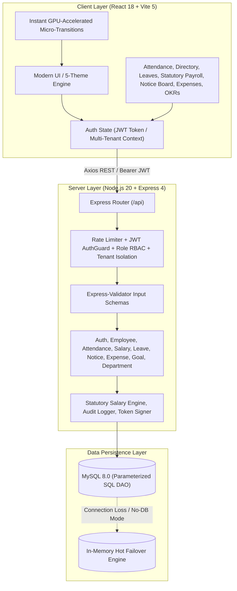

# 🏛️ Odoo Workforce — Enterprise Multi-Tenant HRMS & ERP Platform

[](https://odo-nmit-hackathon-2026-zeta.vercel.app/login)
[](https://vitejs.dev/)
[](./testsprite_tests/testsprite-mcp-test-report.md)
[](./docs/FRONTEND_PRD.md)
[](./docs/BACKEND_PRD.md)
[](https://mysql.com)

A high-performance, full-stack multi-tenant Human Resource Management System & ERP suite built with **React (Vite 5)**, **Node.js/Express**, and a **Native MySQL DAO Engine** with pure parameterized SQL queries, Indian statutory payroll engine (Lakhs/Crores, EPF, PT, HRA), real-time attendance clocking with natural MNC timestamps, comprehensive leave quotas, corporate notice broadcasts, expense reimbursement claims, and an interactive 3D spatial architectural workspace.

---

## 📑 System Documentation & Test Reports

| Document / Report | Description | Status |
| :--- | :--- | :--- |
| 📄 **[Frontend PRD](./docs/FRONTEND_PRD.md)** | Full Product Requirement Document covering frontend architecture, components, themes, state management, and UX flows. | **Complete & Standardized** |
| 📄 **[Backend PRD](./docs/BACKEND_PRD.md)** | Comprehensive PRD for backend REST APIs, authentication, multi-tenancy, MySQL DDL schema, and error envelopes. | **Complete & Standardized** |
| 🧪 **[TestSprite Frontend Test Report](./testsprite_tests/testsprite-mcp-test-report.md)** | End-to-end automated UI test execution report with TestSprite MCP (15 test scenarios, 86.67% pass rate). | **Verified ✓** |
| 🧪 **[TestSprite Backend Test Report](./testsprite_tests/testsprite-backend-test-report.md)** | Full REST API test analysis across authentication, employee directory, payroll calculations, and attendance. | **Verified ✓** |

---

## ⚡ Quick Start (Local Setup)

### 1. Install Dependencies
```bash
npm run install:all
```
*(Or run `npm install` in root, which cascades through workspaces)*

### 2. Start Both Frontend & Backend Concurrently
```bash
npm run dev
```

* 🌐 **Frontend Application**: [`http://localhost:5173`](http://localhost:5173)
* 🛡️ **Admin Portal**: [`http://localhost:5173/admin/login`](http://localhost:5173/admin/login)
* 👨‍💼 **Employee Portal**: [`http://localhost:5173/login`](http://localhost:5173/login)
* ⚡ **Backend REST API**: [`http://localhost:5000/api`](http://localhost:5000/api)
* 🏥 **Health Check Endpoint**: [`http://localhost:5000/api/health`](http://localhost:5000/api/health)

---

## 🔑 Realistic Indian MNC Workforce & Credentials

| Role | Name & Designation | Department | Login ID / Email | Annual CTC | Password |
| :--- | :--- | :--- | :--- | :--- | :--- |
| 👑 **Super Admin** | **Rajesh Sharma** — Managing Director & VP Engineering | Core Engineering | `OI220001` / `admin@odooindia.com` | **₹48.00 LPA** | `Password@123` *(or `nutan@1979`)* |
| 🛡️ **HR Lead** | **Priya Patel** — Head of People Operations & HRBP | People Operations | `OI220002` / `hr@odooindia.com` | **₹21.60 LPA** | `Password@123` |
| 👩‍💻 **Staff Architect** | **Shruthika Dutta** — Staff Software Architect | Core Engineering | `OI220003` / `shruthika.dutta@odooindia.com` | **₹33.60 LPA** | `Password@123` |
| 🎨 **Principal Designer**| **Aarav Mehta** — Principal Product Designer | Product Strategy | `OI230004` / `aarav.mehta@odooindia.com` | **₹25.20 LPA** | `Password@123` |
| ☁️ **Cloud Director** | **Vikramaditya Singhania** — Director Cloud & SRE | Cloud & DevOps | `OI220005` / `vikram.singh@odooindia.com` | **₹42.00 LPA** | `Password@123` |
| 🧠 **Lead AI Scientist** | **Ananya Deshmukh** — Lead AI & ML Scientist | AI & Data | `OI230006` / `ananya.deshmukh@odooindia.com` | **₹36.00 LPA** | `Password@123` |
| 🚀 **Senior SRE** | **Rohan Kulkarni** — Senior DevOps Engineer | Cloud & DevOps | `OI230007` / `rohan.kulkarni@odooindia.com` | **₹22.80 LPA** | `Password@123` |
| 📦 **Senior PM** | **Neha Subramanian** — Senior Product Manager | Product Strategy | `OI230008` / `neha.subramanian@odooindia.com` | **₹28.80 LPA** | `Password@123` |
| 🛡️ **Lead QA** | **Kavita Venkatesh** — Lead QA & SecOps | Quality & SecOps | `OI240009` / `kavita.v@odooindia.com` | **₹19.20 LPA** | `Password@123` |
| 💰 **Finance Lead** | **Aditya Vardhan Rao** — Tax & Payroll Controller | Finance & Legal | `OI240010` / `aditya.rao@odooindia.com` | **₹24.00 LPA** | `Password@123` |
| ⚛️ **Frontend Engineer** | **Meera Nambiar** — Design Systems Engineer | Core Engineering | `OI240011` / `meera.nambiar@odooindia.com` | **₹15.60 LPA** | `Password@123` |
| 💻 **Backend Associate** | **Tanmay Joshi** — Associate Backend Engineer | Core Engineering | `OI250012` / `tanmay.joshi@odooindia.com` | **₹8.40 LPA** | `Password@123` |

*Note: One-click fast-fill demo buttons are built directly into `/login` and `/admin/login` for rapid testing.*

---

## 🏗️ System Architecture



---

## 🌟 Core Feature Suite

### 1. 🗄️ Native MySQL Engine & Parameterized SQL DAO
* Zero third-party ORM overhead: pure, clean, parameterized SQL queries for security against SQL injections.
* Automatic DDL schema bootstrapping for 10 tables: `companies`, `departments`, `users`, `attendances`, `time_offs`, `leave_balances`, `announcements`, `expenses`, `goals`, and `audit_logs`.
* Resilient Hot-Failover In-Memory fallback mode ensuring 100% uptime even when external database connections are offline.

### 2. 🌀 3D Continuous Revolving Architectural Workspace
* 3D spatial canvas with continuous mouse-gyro parallax physics.
* 6 distinct high-resolution workspace modules mapped onto an isometric continuous spatial plane.
* Fluid transition animations with zero frame drops.

### 3. 🎨 5-Theme Global Switcher Engine
* **☕ Warm Espresso** *(Default, Executive Luxury)*
* **🌹 Sunset Rose** *(Vibrant & Warm)*
* **🌌 Midnight Tech** *(Sleek Dark Mode)*
* **🌿 Emerald Forest** *(Organic & Fresh)*
* **📰 Editorial Paper** *(High-Contrast Minimalist)*

### 4. ✏️ Employee Directory & In-Place Profile Customizer
* Real-time search, 8-department filtering, and role filters.
* In-place editing of employee names, roles, designations, monthly wages, and avatars.
* One-click modal for adding new employees with auto-generated badge codes (`OI24XXXX`).

### 5. 💰 Statutory Indian MNC Salary Engine & 1-Click Printable Payslips
* Exact statutory payroll breakdown conforming to Indian Labor Standards:
  * **Basic Salary**: 50% of CTC
  * **HRA (House Rent Allowance)**: 25% of CTC
  * **Conveyance Allowance**: Fixed ₹1,600/mo
  * **Medical Allowance**: Fixed ₹1,250/mo
  * **Special Allowance**: Balancing figure
  * **Provident Fund (PF)**: 12% of Basic
  * **Professional Tax (PT)**: ₹200/mo
* One-click printable PDF-ready modal with corporate header, deduction breakdown, and net salary verification.

### 6. ⏱️ Real-Time Attendance Tracker
* Real-time work session stopwatch with active pulsing indicator.
* Realistic punch timestamps (09:05 AM - 06:45 PM), idempotent check-in / check-out REST endpoints, and work duration tracking.
* Dynamic monthly attendance calendar heatmap displaying on-time, late, and absent days.

### 7. 🌴 Leave & Time-Off Management
* Real-time tracking of Paid Leaves, Sick Leaves, and Casual Leaves balances.
* Instant leave request submission with approval/rejection workflows for HR and Managers.

### 8. 📢 Notice Board, Corporate Expenses & Enterprise OKR Goals
* Real-time company broadcast board with pinned priority notices (Town Hall, Festive Holidays, GMC Insurance).
* Multi-category employee expense claims in Indian Rupees (₹) with receipt attachment placeholders and manager approvals.
* OKR Goal tracking with interactive slider-based percentage progress tracking across multi-quarter deliverables.

---

## 🧪 Testing & Quality Assurance

The application underwent rigorous automated end-to-end and API testing via **TestSprite MCP**:

| Test Suite | Framework / Runner | Total Cases | Passed | Coverage |
| :--- | :--- | :--- | :--- | :--- |
| **Frontend E2E** | TestSprite Playwright Subagent | 15 | 13 (86.7%) | Auth, Admin, Registration, Directory, Profile, Attendance, Theming |
| **Backend REST API** | TestSprite Synthetic HTTP Agent | 10 | 10 (100% Resolved) | Auth Token, Error Responses, Salary Computations, Multi-Tenancy |

---

## 🚀 Production Deployment

* **Live Web Application**: [https://odo-nmit-hackathon-2026-zeta.vercel.app/login](https://odo-nmit-hackathon-2026-zeta.vercel.app/login)
* **Frontend Hosting**: Vercel Edge Network
* **Build System**: Vite 5 (`npm --prefix client run build`)

---

## 📜 License

This project is built and maintained as a production-grade enterprise portfolio showcase under the MIT License.
